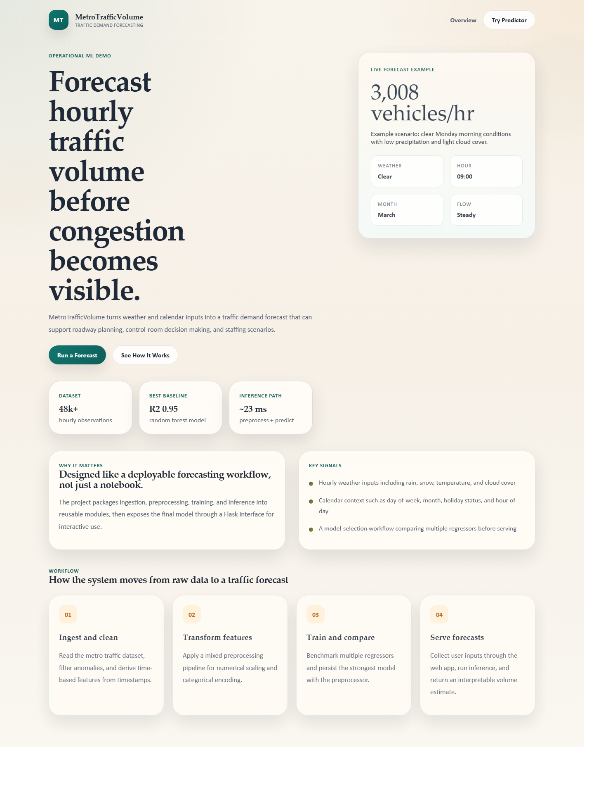
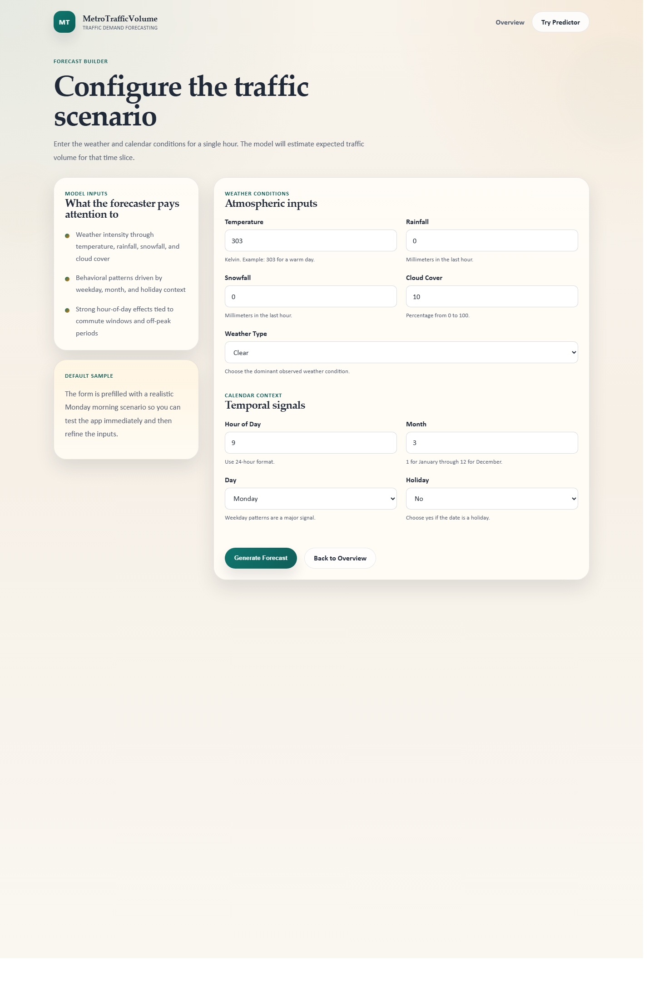
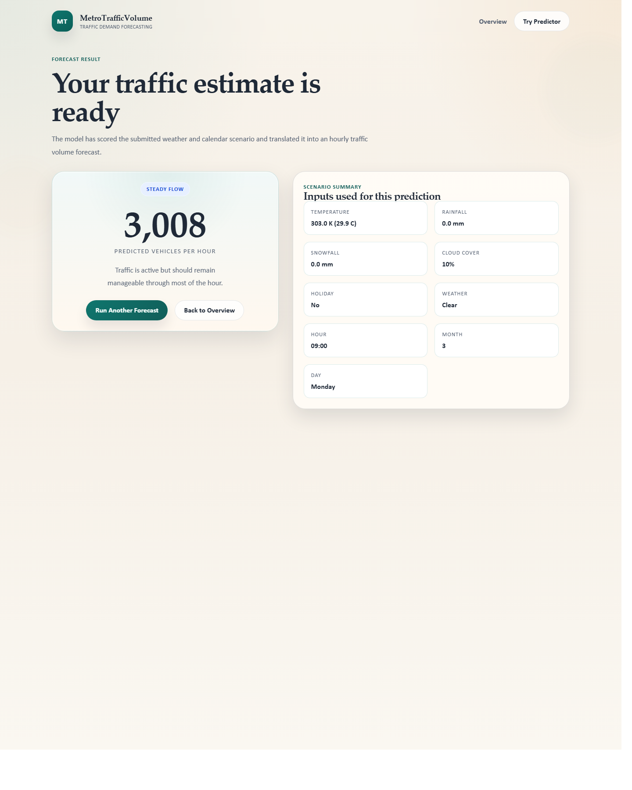

# Metro Traffic Volume Prediction System

Predict hourly interstate traffic volume from weather and calendar signals to support congestion planning, staffing decisions, and operational forecasting.

## 🚀 Overview

This project is an end-to-end machine learning system for traffic demand prediction built on the Metro Interstate Traffic Volume dataset. It goes beyond notebook experimentation by packaging the workflow into reusable training and inference pipelines, persisting preprocessing/model artifacts, and exposing predictions through a Flask web app.

Why it matters:

- Traffic volume forecasting is a practical operations problem for roadway planning, traffic control centers, staffing, incident readiness, and infrastructure analysis.
- The project converts raw hourly weather and timestamp data into a deployable regression workflow rather than stopping at EDA.
- It demonstrates the core pieces recruiters look for in ML engineering projects: data cleaning, feature engineering, model selection, artifact management, inference integration, logging, and user-facing delivery.

## 🧠 Key Features

- End-to-end pipeline with separate ingestion, transformation, training, and prediction modules under `src/`.
- Cleans anomalous rows and engineers temporal features such as hour-of-day, month, and day-of-week from raw timestamps.
- Compares multiple regression models instead of hard-coding a single estimator.
- Persists preprocessing logic and trained model artifacts for training/serving consistency.
- Includes a browser-based Flask interface so non-technical users can generate predictions interactively.
- Uses structured logging and custom exception handling to make failures traceable across training and inference.
- Keeps experimentation and production-style code separate: notebooks for analysis, Python modules for repeatable pipelines.
- Captures feature-importance patterns that align with real-world traffic behavior, with time-of-day and day-of-week emerging as dominant signals.

## ⚙️ Tech Stack

### ML / Data

- Python
- pandas
- NumPy
- scikit-learn
- Random Forest, Gradient Boosting, Decision Tree, Linear Models, AdaBoost

### App / Serving

- Flask
- Jinja2 templates
- HTML/CSS

### Pipeline / Engineering

- Modular package structure with `setuptools`
- Serialized artifacts with `pickle`
- Custom logging and exception wrappers

### Analysis / Experimentation

- Jupyter notebooks
- matplotlib
- seaborn

## 📊 Results / Performance

Benchmarks below are based on the repository's persisted train/test split plus notebook outputs already included in the project.

### Dataset

- Raw records: `48,204` hourly observations
- Cleaned records after filtering anomalies: `48,193`
- Train set: `36,144`
- Test set: `12,049`
- Target: hourly `traffic_volume`

### Current Baseline Leaderboard

| Model | Test R² | RMSE | MAE | Train Time |
|---|---:|---:|---:|---:|
| RandomForestRegressor | 0.9487 | 450.60 | 252.89 | 0.92s |
| DecisionTreeRegressor | 0.9193 | 565.32 | 290.74 | 0.10s |
| GradientBoostingRegressor | 0.9179 | 570.14 | 394.71 | 1.76s |

### Performance Highlights

- Best baseline on the repo artifact split: `RandomForestRegressor`
- Test R²: `0.9487`
- Test RMSE: `450.60` vehicles/hour
- Test MAE: `252.89` vehicles/hour
- Single-row preprocess + predict latency: `~22.8 ms` on CPU
- Notebook tuning result: grid-searched Gradient Boosting reached `RMSE 429.15`

### What These Numbers Mean

- Tree-based ensembles clearly outperform linear baselines, which indicates the traffic problem is strongly nonlinear.
- The model is accurate enough to capture broad traffic dynamics and useful for operational planning or dashboard prototyping.
- The tuned notebook result suggests additional headroom remains if hyperparameter search is fully integrated into the production pipeline.

## 🏗️ Architecture / How It Works

### Pipeline Flow

1. `data_ingestion.py` reads the raw CSV, converts `date_time` into engineered time features, filters invalid rows, and writes raw/train/test artifacts.
2. `data_transformation.py` builds a `ColumnTransformer`:
   - Numerical features: imputation + scaling
   - Categorical features: imputation + encoding
3. `model_trainer.py` trains multiple regressors, evaluates them, and selects the best-performing model.
4. The preprocessing object and trained model are serialized into `artifacts/`.
5. `prediction_pipeline.py` loads the artifacts and transforms incoming user input for inference.
6. `app.py` exposes the workflow through a Flask UI where users submit weather/time inputs and receive predicted traffic volume.

### Architecture Diagram


## 🧪 Challenges & Engineering Decisions

- **Why tabular ML instead of sequence forecasting first:** the project prioritizes a production-friendly supervised pipeline that is easier to train, explain, and serve than ARIMA/LSTM-style forecasting for a first deployable version.
- **Why tree ensembles won:** traffic volume depends on nonlinear interactions between hour, weekday patterns, weather conditions, and seasonality. The model comparison validates this instead of assuming it.
- **Why persist preprocessing artifacts:** training-serving skew is a common ML failure mode. Persisting the transformation step helps keep inference aligned with training.
- **Version compatibility surfaced a real engineering issue:** the repo’s pickled preprocessing artifacts were created in an older scikit-learn environment, which is exactly the kind of dependency drift production ML systems need to handle through pinned versions or artifact rebuilds.
- **Serving trade-off:** the current inference path loads artifacts inside the request flow. That keeps the app simple and stateless, but caching the model/preprocessor at startup would reduce latency and improve throughput.
- **Feature representation trade-off:** decomposing timestamps into `time`, `month`, and `day` keeps the model simple and interpretable, but cyclical encodings or richer temporal context could improve edge cases around seasonality and rush-hour transitions.

## 📸 Demo

### Landing Screen



### Forecast Form



### Prediction Result



## ▶️ How to Run

### 1. Clone the repository

```bash
git clone https://github.com/SoniPrithish/MetroTrafficVolume.git
cd MetroTrafficVolume
```

### 2. Create a virtual environment

```bash
python -m venv .venv
```

On Windows:

```bash
.venv\Scripts\activate
```

On macOS/Linux:

```bash
source .venv/bin/activate
```

### 3. Install dependencies

```bash
pip install -r requirements.txt
```

Note:

- Regenerate the model artifacts locally after install. The checked-in pickles were created in an older environment, and retraining avoids version mismatch issues.

### 4. Train artifacts

Run this once to generate the latest preprocessing and model artifacts locally:

```bash
python -m src.pipeline.training_pipeline
```

### 5. Start the app

```bash
python app.py
```

Then open:

```bash
http://localhost:5000
```

## 📌 Future Improvements

- Replace request-time artifact loading with app-start caching for lower inference latency.
- Add pinned dependency management and artifact versioning to eliminate pickle compatibility issues.
- Integrate time-aware cross-validation instead of only random train/test splitting.
- Add automated experiment tracking with MLflow or Weights & Biases.
- Promote the tuned Gradient Boosting pipeline into the main training path.
- Add an API layer for programmatic inference in addition to the HTML form.
- Containerize the app and add CI checks for training, inference, and template rendering.
- Add monitoring for feature drift and prediction quality over time.

## Why This Project Stands Out

- It is not just an EDA notebook; it includes a trainable pipeline, reusable Python package structure, saved artifacts, and an interactive application.
- It demonstrates both software engineering and ML engineering depth in the same repo.
- It shows practical product thinking: data ingestion, model benchmarking, deployment path, and opportunities for production hardening.
